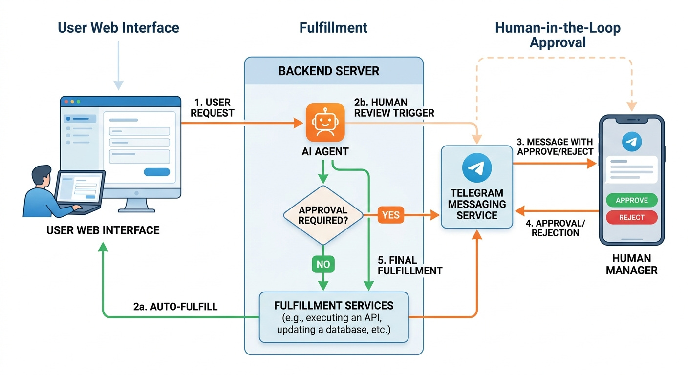

# Human-in-the-Loop AI Agents with Google ADK and Telegram

A reimbursement agent that pauses for human approval via Telegram, with a FastAPI backend and a live chat UI.



## Setup

```bash
cp .env.example .env
# Fill in GOOGLE_CLOUD_PROJECT, GOOGLE_CLOUD_LOCATION,
# TELEGRAM_API_KEY, TELEGRAM_CHAT_ID
```

```bash
pip install google-adk fastapi uvicorn httpx python-dotenv
```

```bash
uvicorn api:app --reload
```

Open `http://localhost:8000` and try:

- `"Reimburse $50 for lunch"` → auto-approved
- `"Reimburse $200 for conference travel"` → Telegram approval request sent to manager
